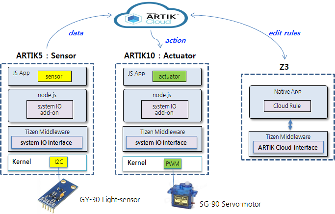

##Instruction for simple guide

1) prepaer sensor board : ARTIK5 with Tizen
2) prepaer actuator board : ARTIK10 with Tizen
3) install "system IO Interface" module into each boards
  * capi-iotbus-0.0.1-0.armv7l.rpm
  * capi-iotbus-server-0.0.1-0.armv7l.rpm
4) install "system IO add-on" node module
  * ARTIK5 : node-iotbus_artik5-0.9.0-1.armv7l.rpm 
  * ARTIK10 : node-iotbus_artik10-0.9.0-1.armv7l.rpm
5) install sensor application 
  * sensor_server.js  
  * sensor_things.js 
6) install sensor application
  * actuator_server.js
  * actuator_things.js
  
##Instruction for developer
Please download the patch according to your target
There is a patch related to cloud demo.
And, this patch is composed with 2 groups of patchset.
One is node_iotbus that node addon for capi-iotbus, and can be referred below path.
* https://github.com/tizen-artik/node_iotbus
And, the other is iotbus that is a package for control system io and capi.
* https://github.com/tizen-artik/iotbus

We checked the functionality based on the binary of tizen-common-artik_20161007.97 version.
Please refer to below path to get the version.
* http://download.tizen.org/releases/weekly/tizen/common_artik/tizen-common-artik_20161007.97/  => it will be updated and lasted.
* http://download.tizen.org/snapshots/tizen/common_artik/tizen-common-artik_20161007.97/ => it will be lasted for 2 weeks

Here is steps how to run patches
<pre>
1) find script (patch-demo_artik5 / patch-demo_artik10)

2) run patch according to target board
 : for artik5
 $ sudo ./patch-demo_artik5
=> if the patch is done, it can be rebooted automatically.

 :for artik10
 $ sudo ./patch-demo_artik10
=> if the patch is done, it can be rebooted automatically.
</pre>

By the way, unleass install driver(ddk...) demo patch will not be worked.
